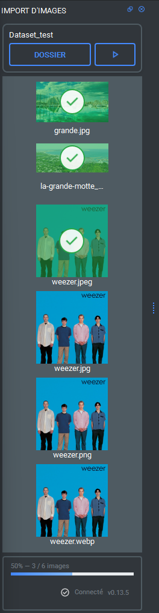

# Importation d'images dans le jeu de données

Cet outil permet d'importer des images dans le jeu de données. Son rôle est de permettre à l'utilisateur de sélectionner les images qu'il souhaite traiter.

Pour importer des images, commencez par sélectionner le dossier contenant celles-ci à l'aide du bouton « DOSSIER ». Une fois les images importées dans l'application, il vous suffit de lancer leur traitement via le bouton play.

L'état de chaque image est indiqué par une couleur :

- les images traitées sont affichées en vert.
- les images en cours de traitement sont affichées en jaune.
- les images ayant rencontré une erreur sont affichées en rouge.

Une image déjà traitée ne peut pas être retraitée. Pour la traiter à nouveau, vous devez d'abord la supprimer de la base de données.

En bas de la fenêtre, vous pouvez consulter la progression du traitement des images ainsi que l'état de connexion au serveur Ollama.

> **Attention** : vous devez être connecté au service Ollama utilisé par l'IA (par exemple via le réseau de l'IUT) afin de pouvoir traiter les images.
