# Menus de l'application

Les menus de l'application est composé de quatre parties :

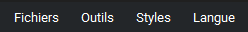

## Fichier

Ce menu regroupe les fonctionnalités d'importation et d'exportation des données du jeu de données.

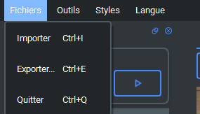

### Importer/Exporter

L'importation peut être effectuée de deux manières :

- importation d'un fichier contenant des jeux de données définis.
- importation d'un fichier sans jeux de données.

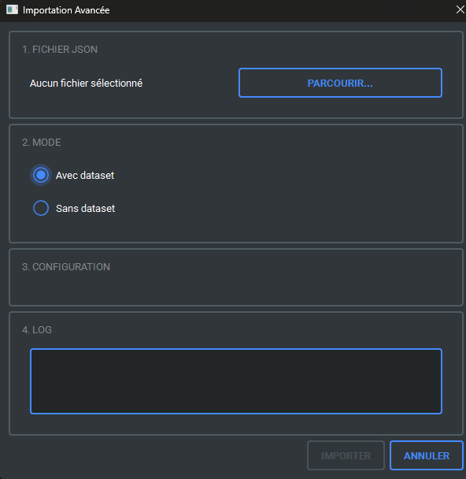

#### Format JSON

Schéma sans jeu de données (simple)
```json

{
  <nom de l'image>: {
    "id": <nom de l'image>,
    "path": <chemin de l'image>,
    "description": <description>,
    "keywords": [
      <mot clé 1>,
      <mot clé 2>,
      ...,
      <mot clé n>
    ],
    "embedding": [ ... ]
  }
}

```

Schéma avec jeu de données (intégral)

```json

{
  <nom de l'image>: {
    "id": <nom de l'image>,
    "path": <chemin de l'image>,
    "description": <description>,
    "keywords": [
      <mot clé 1>,
      <mot clé 2>,
      ...,
      <mot clé n>
    ],
    "dataset": <nom jeu de données>,
    "embedding": [ ... ]
  }
}
```

#### Importation sans datasets

Il existe deux mode d'importation sans dataset:

la fusion de toute les images en 1 dataset

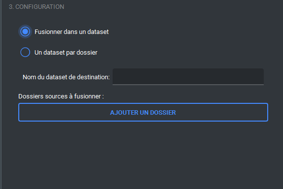

un dataset par dossier d'images

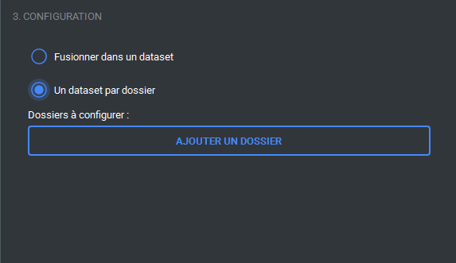

#### Importation avec datasets

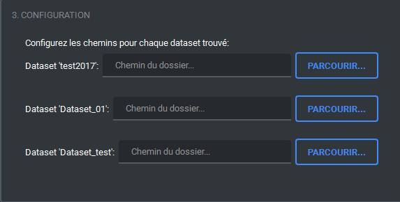

### Exporter

De la même manière l'export fonctionne de deux manières:
- Avec datasets
- Sans datasets

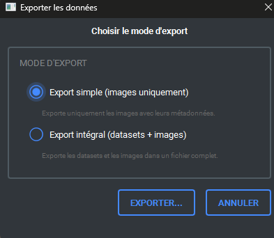

## Outils

La partie outils est simple, il y a une option qui permet d'afficher/caché l'outil d'import d'image

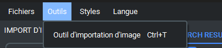

## Style

La partie de style permet de changer le thème actuelle de l'application

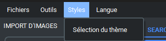

Double cliquez sur un thème et il s'applique et s'enregistre

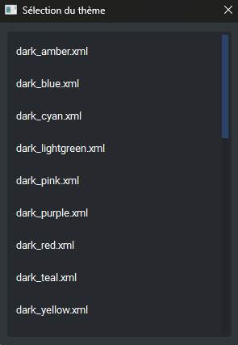

## Langue

L'option permet de changer la langue parmit toute les langues disponibles

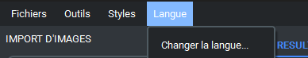

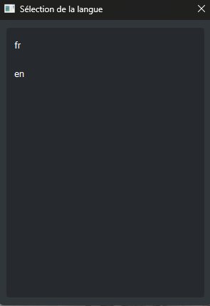