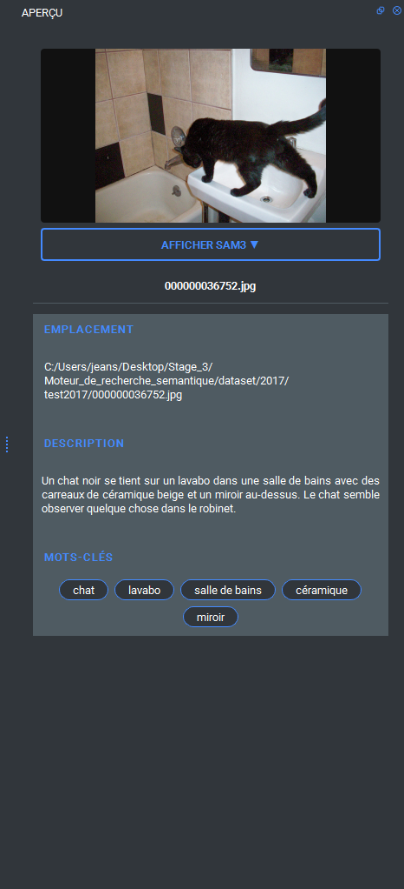
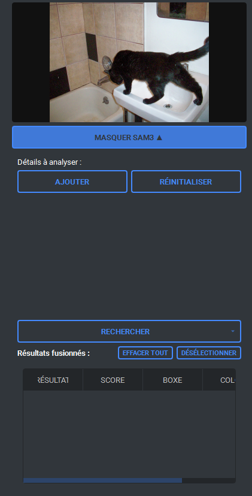
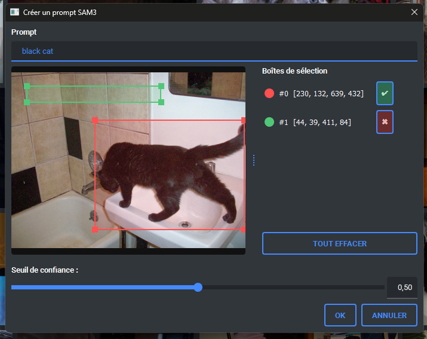
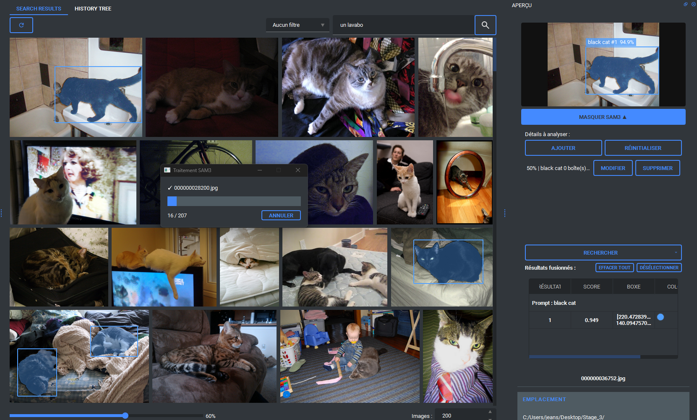
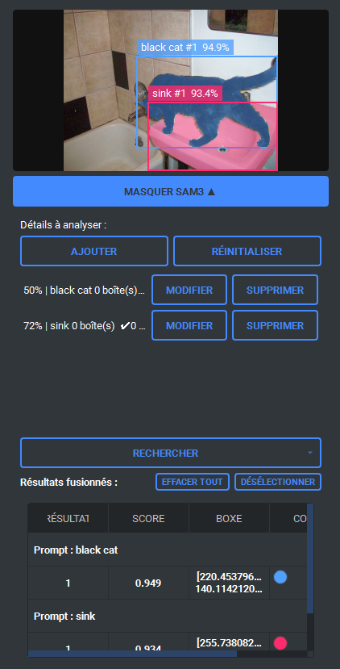

# Prévisualisation de l'image

La zone de prévisualisation permet de consulter les informations utilisées par le moteur de recherche pour retrouver une image. Vous pouvez notamment y voir :

- l'emplacement du fichier.
- la description et les mots clés générée

## Outil SAM3

L'outil SAM3 est une fonctionnalité permettant de repérer une partie précise d'une image (par exemple : un chat noir). Comme il s'agit d'un modèle développé par META, les requêtes textuelles doivent être saisies en anglais pour que le modèle fonctionne correctement.

L'outil se compose de trois parties :

- l'image et l'affichage visuel des résultats
- l'interface de création des prompts
- l'affichage détaillé des résultats.

### Interface de création de prompt

Pour créer un prompt, cliquez sur Ajouter. Une fenêtre s'ouvre alors vous pouvez y saisir :

- un intitulé pour le prompt.
- un texte descriptif en anglais.

L'intitulé est facultatif si votre objectif est uniquement de traiter l'image actuellement affichée.

Vous pouvez également sélectionner des zones de l'image afin de créer des boîtes de détection :

- une boîte positive indique à SAM3 qu'il doit concentrer sa recherche sur cette zone précise.
- une boîte négative indique à SAM3 qu'il doit ignorer cette partie de l'image.

Par exemple, une boîte positive placée sur un chat noir aidera SAM3 à rechercher des résultats correspondant à cet élément.

Enfin, un seuil de confiance est disponible en bas de la fenêtre. Il permet de définir à partir de quel niveau de confiance SAM3 doit afficher un résultat.

> **Attention** : pour qu'un prompt soit valide, il doit contenir au moins une entrée de texte ou une boîte de détection. En revanche, pour lancer une recherche sur l'ensemble des images affichées, une entrée de texte est obligatoire.

Chaque prompt peut être modifié ou supprimé.

Pour envoyer les prompts à SAM3, deux options sont disponibles :

- traiter uniquement l'image actuellement affichée.
- traiter toutes les images présentes dans les résultats de recherche.

Lors du lancement d'un traitement sur plusieurs images, une fenêtre affiche le nombre d'images restantes à traiter. Vous pouvez interrompre le traitement à tout moment puis le reprendre ultérieurement ; celui-ci redémarrera à l'endroit où il s'était arrêté.

À partir du premier résultat affiché, un outil de filtrage apparaît afin de permettre l'affichage exclusif des images possédant un résultat SAM3.

Il est aussi possible de sélectionner individuellement un ou plusieurs résultats afin de les afficher ou de les masquer. En cliquant sur le nom d'un prompt, vous sélectionnez ou désélectionnez simultanément tous les résultats qui lui sont associés.

