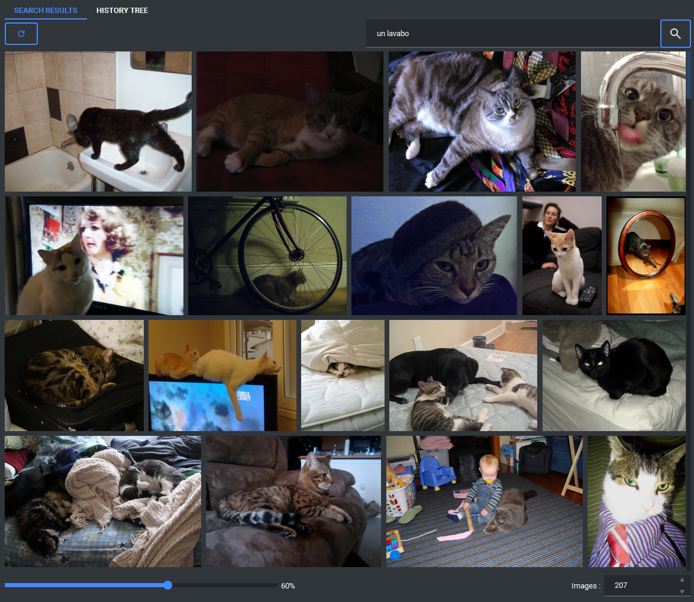
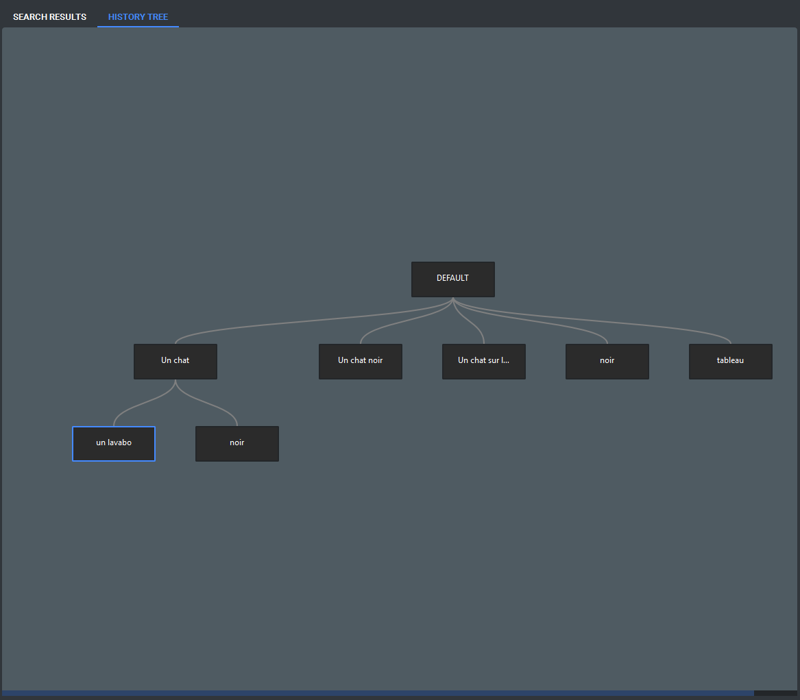
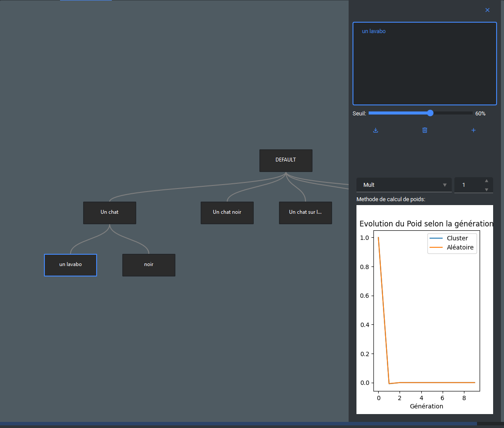

# Rechercher des images

Cette partie de l'application permet d'effectuer des recherches parmi les images importées à l'aide de l'outil d'importation.

Elle est divisée en deux sections, représentées par les onglets « SEARCH RESULTS » et « HISTORY TREE ».

Il existe donc deux manières d'effectuer une recherche :

- une recherche simple à partir d'une seule requête.
- une recherche avancée utilisant un arbre de recherche.

## Sommaire

- [Rechercher des images](#rechercher-des-images)
  - [Sommaire](#sommaire)
  - [SEARCH RESULTS](#search-results)
    - [En haut](#en-haut)
    - [En bas](#en-bas)
  - [HISTORY TREE](#history-tree)
    - [Gestion des poids](#gestion-des-poids)

## SEARCH RESULTS

La partie de recherche classique propose plusieurs fonctionnalités.

### En haut

- recharger la page en conservant la recherche actuelle
- saisir une requête dans la barre de recherche.
- appliquer un filtre pour les résultat SAM3 ([voir la prévisualisation](../Previsualisation_Image/preview_image.md))

### En bas

- définir le seuil de recherche.
- choisir le nombre d'images à récupérer.

Le seuil de recherche permet de définir la marge d'écart acceptable entre le vecteur cible (généré à partir du prompt) et le vecteur associé à une image. Un seuil plus élevé peut permettre d'obtenir des images liées au thème principal, même si elles s'éloignent davantage de la requête initiale.

Le paramètre du nombre d'images détermine combien de résultats doivent être affichés. Après avoir modifié cette valeur, il est nécessaire de recharger la recherche à l'aide du bouton de rechargement de la page pour appliquer le changement.

## HISTORY TREE

Cette section permet de combiner plusieurs recherches en leur attribuant des poids différents.

Le résultat final est calculé en additionnant les scores de similarité de chaque recherche, pondérés par leur poids respectif. Les images obtenant le score total le plus élevé sont alors affichées.

L'objectif de cette approche est de mettre en avant des résultats qui ne seraient pas forcément trouvés avec une seule requête ou avec une requête combinée classique. Par exemple, une recherche basée sur les termes « chat » et « lavabo » peut produire des résultats différents d'une simple recherche « un chat sur un lavabo ».

La partie classique sert ensuite à afficher les résultats de cette recherche multiple.

Pour utiliser l'arbre de recherche, il suffit de double-cliquer sur un nœud correspondant à une recherche afin d'ouvrir sa vue détaillée.

Depuis cette fenêtre, vous pouvez :

- modifier le texte de la recherche.
- modifier son seuil.
- ajuster son poids.

Vous pouvez ajouter un nouveau nœud :

- en cliquant sur le bouton situé à droite.
- ou en effectuant une recherche depuis la partie classique.

Le bouton situé à gauche permet d'enregistrer les modifications apportées au nœud, tandis que celui du milieu permet de le supprimer.

Vous pouvez ajouter un noeux avec le bouton à droite ou en fesant une recherche sur la partie classique

Le bouton à gauche sert à sauvegarder les changements apportés et celui du millieu sert à supprimer le noeud.

### Gestion des poids

La configuration du poids d'une recherche s'effectue en deux étapes :

- sélectionner la méthode de calcul
- définir une constante associée (optionnelle pour certaines méthodes)

Le graphique affiché en dessous fournit un exemple représentatif du comportement du poids choisi. Il permet de visualiser son évolution selon la méthode sélectionnée (par exemple, la méthode SUM produit une croissance de plus en plus importante).

L'utilisation de poids différents permet d'accorder plus ou moins d'importance à certaines requêtes. Par exemple, pour une recherche combinant « chat » et « noir », si vous souhaitez privilégier le critère « chat » et considérer « noir » comme secondaire, vous pouvez attribuer un poids plus important à la première recherche.

