# Introduction

## Problématique

Vous disposez d'une image qui vous intéresse et vous souhaitez retrouver d'autres images similaires afin de les admirer encore plus.

## Image de départ


## Lancer l'application

Vous lancez alors l'application de recherche sémantique installée sur votre ordinateur :

```py
(commande à faire à la racine du projet)
(commande faite sur windows)
> python main.py 
```

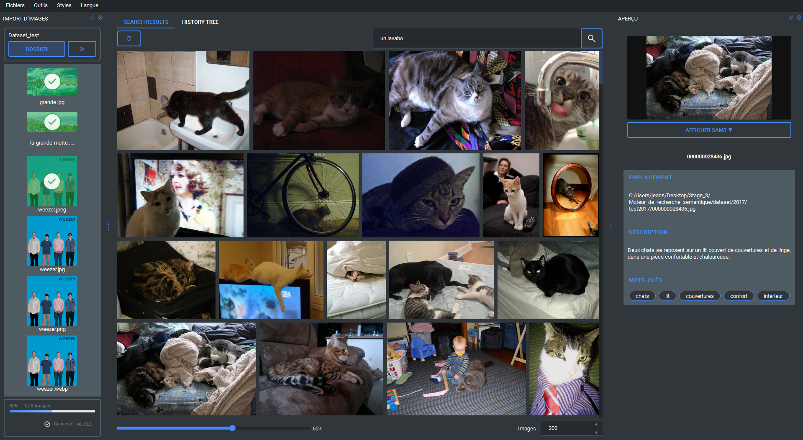

> Remarque : Vous n'aurez sûrement pas recherché un chat sur un lavabo et n'aurez pas non plus importé un jeu d'images de test, il est donc normal que les images affichées varient selon votre utilisation / inutilisation de l'application.

## Importer l'image dans le jeu de données

### Sélectionner le dossier contenant votre image

> Remarque : L'image peut être dans les formats suivants : `.png`, `.webp`, `.jpg`, `.jpeg`


Vous devriez vous retrouver avec ce résultat.

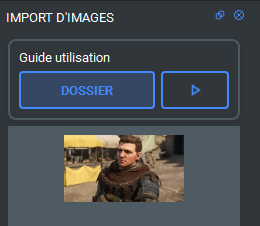

### Lancer le traitement de l'image

Comme dit dans le titre, il vous faut maintenant lancer le traitement de l'image pour pouvoir obtenir la description et les mots-clés générés par IA.

Pour lancer le traitement il vous suffit de cliquer sur le bouton  en haut à droite de l'outil d'importation.

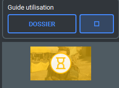

Après une attente plus ou moins longue l'image devrait être comme ça :

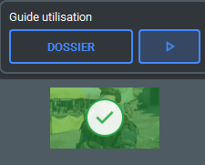

> Remarque : Si l'image revient avec une erreur, le problème vient sûrement du serveur Ollama où se trouve le modèle de traitement d'image en texte.

## Rechercher l'image dans le moteur de recherche

Nous allons maintenant essayer de récupérer l'image dans la partie recherche d'image.

Mais une question se pose : comment trouver le bon prompt pour récupérer l'image ?

### 1ère solution : donner la description dans le prompt

Bien que ce ne soit pas pratique, c'est la meilleure solution pour retrouver à coup sûr l'image voulue. La raison étant que l'embedding a été créé avec la description et les mots-clés de l'image, donc si le prompt transformé en vecteur correspond à celui de la description alors le résultat sera forcément similaire.

> Problème : On ne disposera pas forcément du moyen de trouver l'image en premier lieu, donc cette solution fonctionne dans ce cas précis car on peut récupérer l'image facilement depuis l'outil d'import de jeu de données.

#### Exemple 1

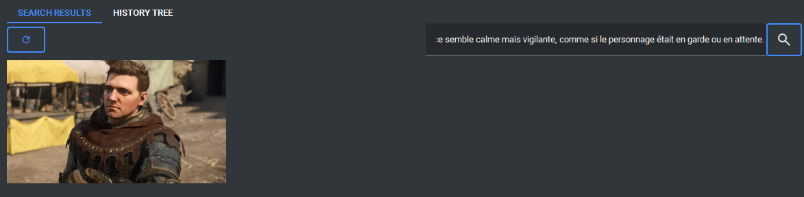

> Note : le seuil est configuré à 90% donc on peut constater que le modèle reconnaît l'image.

### 2ème solution : Essayer de construire un prompt qui pourrait décrire l'image

Cette méthode consiste à essayer d'utiliser différentes façons de décrire l'image car la description étant longue, mettre une partie de l'image dans le prompt peut la faire apparaître, mais si d'autres images correspondent plus à la description elles apparaîtraient en premier.

#### Exemple 2

Avec le prompt `armure` on obtient :
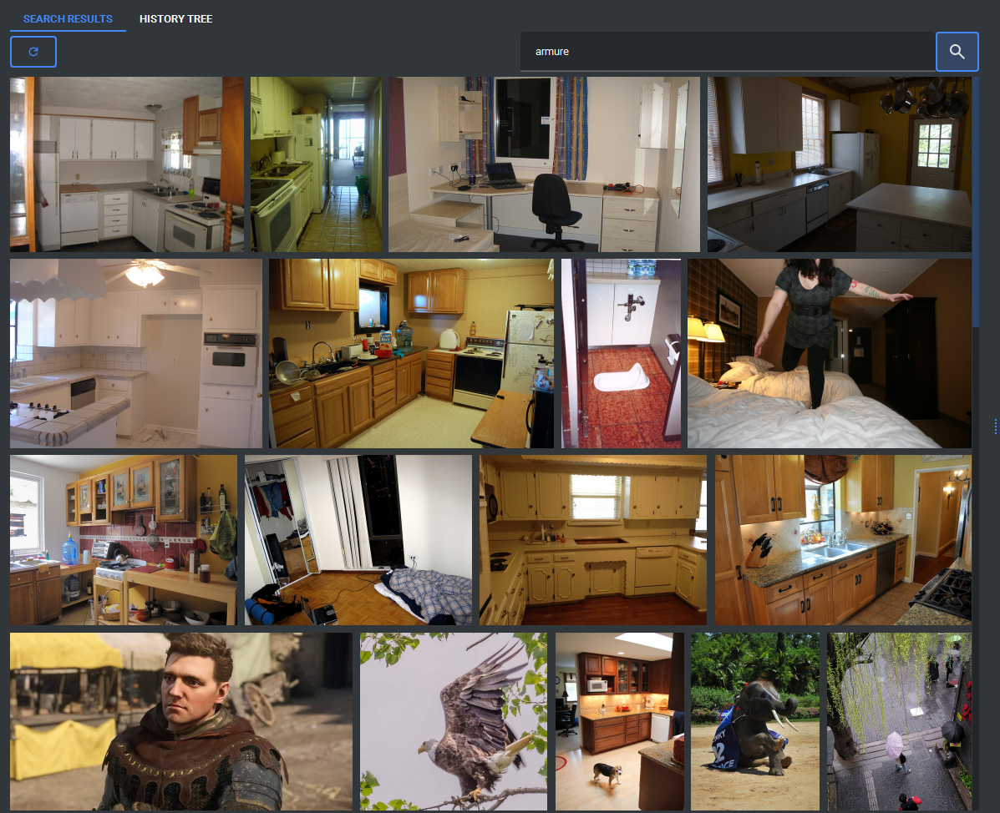

> Note : ici le seuil est à 50% donc le modèle pense qu'il y a un lien mais faible. On peut constater la faible valeur de ce lien à cause des images de cuisine au-dessus, montrant qu'il pense qu'une cuisine est plus proche du mot armure.

### 3ème solution : Utiliser la recherche multiple

Cette méthode utilise l'outil dans `HISTORY TREE` pour créer une recherche plus poussée. Le but est de créer plusieurs nœuds qui décrivent l'image de plus en plus dans les détails et d'ajouter un poids selon l'importance du détail.

#### Exemple 3

Voici un exemple d'arbre de recherche :
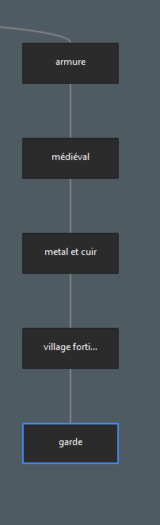

Résultat :
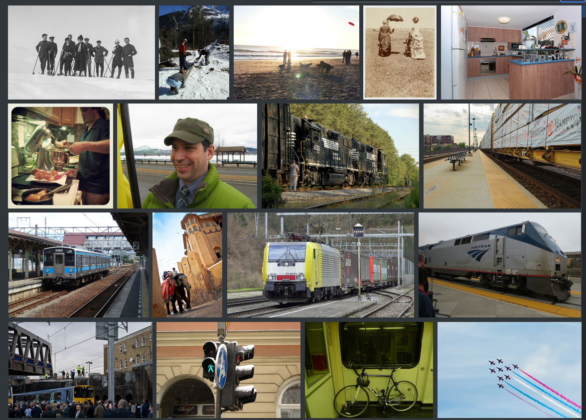

> Note : Le résultat n'apparaît pas dans les premiers, sûrement car sa description est trop précise et pour chaque nœud de l'arbre il apparaît en bas de la liste, voire n'apparaît pas.

### Conclusion sur les types de recherche

Les deux premières solutions sont les plus simples à utiliser car il suffit de bien décrire l'image dans l'entrée de prompt, tandis que la troisième est trop imprécise car elle dépend du fait que si l'image voulue n'est pas trouvée par les recherches individuellement, elle n'apparaîtra pas dans la recherche avec arbre.

## Peaufiner les résultats d'une recherche

Partons du principe que vous trouvez l'image grâce à une des méthodes dites ci-dessus. L'objectif maintenant est de pouvoir trouver des images similaires.

Dans notre exemple il existe deux cas de figure :

- D'autres images similaires sont déjà visibles et vous en avez assez.
- Il vous manque des images et/ou vous en voulez plus.

Dans le cas numéro 2 il existe un moyen d'approfondir la recherche un cran au-dessus. La méthode consiste à utiliser un modèle de segmentation d'image pour récupérer les éléments d'une image.

> Remarque : gros défaut de cette méthode, le modèle prend (cela dépend du PC) 1 seconde de traitement par image, donc très long pour 4 000 images par exemple.

### Trouver le bon prompt pour l'outil SAM3

Pour commencer la recherche de segment d'image il vous suffit de cliquer sur l'image de votre choix (cela peut être n'importe quelle image). Il apparaîtra un outil de visualisation des données de l'image et dessus se trouve une option qui permet de dérouler l'outil nommé `SAM3`.

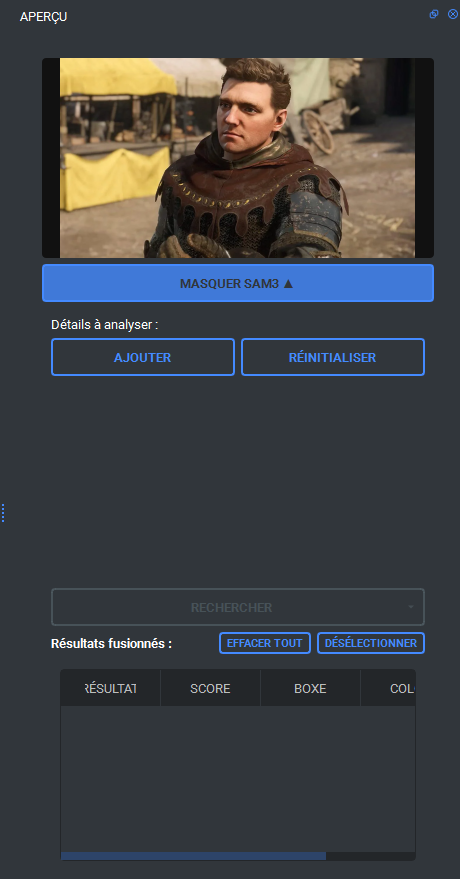

Maintenant il vous suffit de créer le prompt qui permet de sélectionner le détail visuel que vous voulez.

> Remarque : Vous pouvez utiliser la recherche seule pour tester les prompts qui pourraient fonctionner.

#### Exemple 4

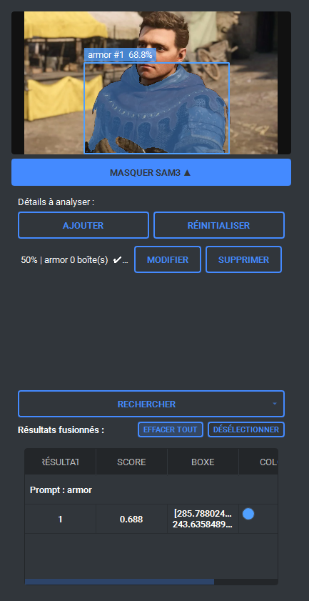

> Remarque : chaque prompt a son propre seuil pour permettre de laisser plus ou moins de liberté à SAM3.

### Lancer la recherche multiple avec SAM3

Une fois que le(s) prompt(s) vous renvoie un résultat satisfaisant, vous pouvez lancer la recherche multiple.

> Remarque : La recherche multiple fonctionne avec les résultats trouvés dans la partie de recherche du milieu, donc si aucun résultat n'est présent cela ne vous retournera rien.

#### Exemple 5

Vous avez juste à attendre que le traitement des images se finisse ; vous pouvez voir les changements en temps réel sur l'application.

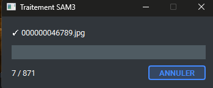

### Filtrer les résultats

Quand le traitement est fini il ne vous reste plus qu'à filtrer les résultats pour afficher seulement ceux avec des résultats SAM3. Pour cela un outil de filtre est à votre disposition à gauche de la barre de recherche.

> Remarque : il n'apparaît que quand il y a des résultats SAM3 (même vides) dans les données des images, donc si vous ne lancez pas de recherche l'outil n'est pas visible.

#### Exemple 6

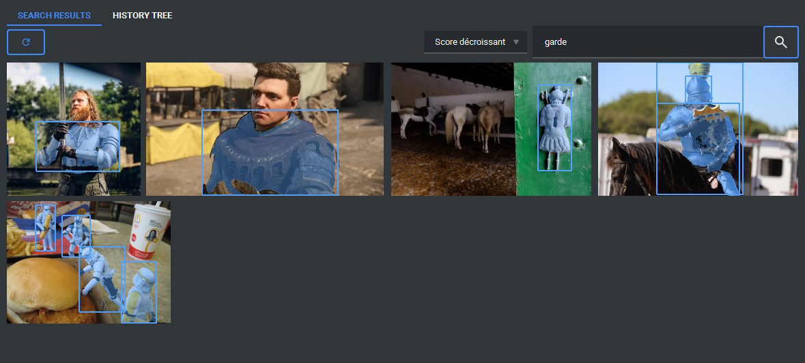

> Remarque : On récupère des images en rapport alors que la recherche s'est faite depuis la recherche faite avec l'arbre de recherche, montrant que l'image était présente mais avec un score de similarité trop faible.

### Conclusion de l'outil SAM3

L'outil nous a permis de trouver des images en rapport à notre image de départ.