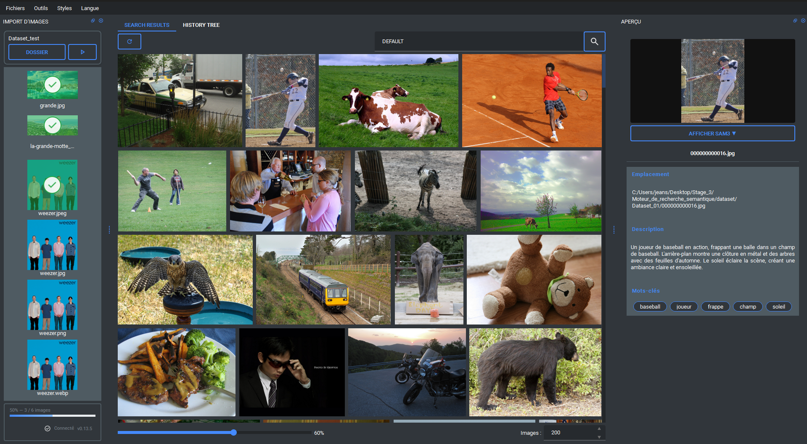

# Documentation Utilisateur

Cette documentation a pour objectif de vous guider dans l'utilisation de l'ensemble des fonctionnalités de l'application.

## Sommaire

1. [Importer un jeu de données d'images](./Importation_Image/importation_image.md)

2. [Rechercher une image](./Recherche_Image/recherche_image.md)

3. [Prévisualiser une image](./Previsualisation_Image/preview_image.md)

4. [Menus](./Menu/menu.md)

5. [Cas d’usage guidé](./fil_utilisation/intro.md)

