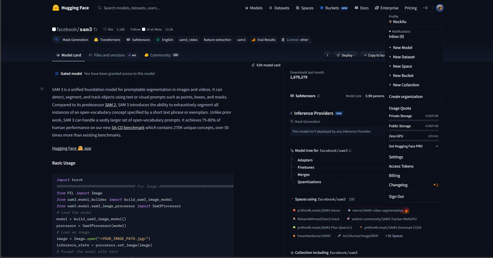
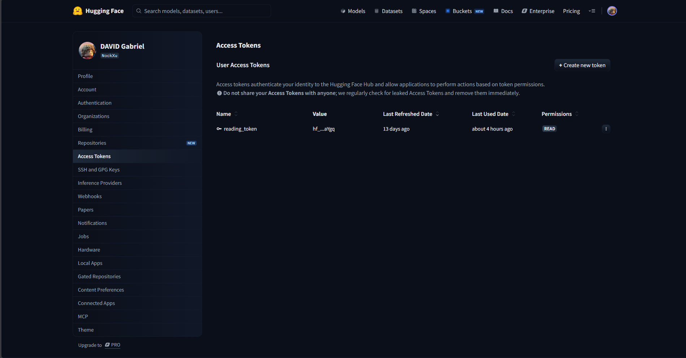
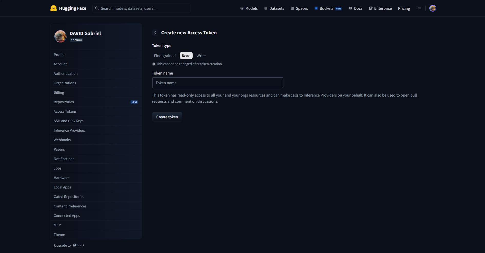

# Accueil

## Description du projet

Ce projet est un moteur de recherche sémantique d’images basé sur des embeddings et une architecture hybride combinant base de données relationnelle et index vectoriel.

Il permet d’indexer, analyser et retrouver des images en fonction de leur contenu sémantique plutôt que de faire correspondre des mots-clés.

## Prérequis

- Python 3.12 minimum
- une carte graphique compatible CUDA (pour l'utilisation de GPU)

## Installation

1. Installer les dépandances pip
```bash
pip install -r requirements.txt
```

2. Installer PyTorch qui prend en charge CUDA
```bash
pip install torch==2.10.0 torchvision --index-url https://download.pytorch.org/whl/cu128
```

3. Cloner le dépôt git de sam3 et installer les dépendances
```bash
cd vision
git clone https://github.com/facebookresearch/sam3.git
cd sam3
pip install -e .
cd ../..
```

4. Installer les dépendances manquantes
```bash
pip install -r requirementsv2.txt
```

5. Accès au model hugging face

Allez sur la page du [dépot](https://huggingface.co/facebook/sam3) du model pour vous y inscrire est avoir l'accès

Ensuite vous devez vous connecter à hugging face sur votre machine:

- Acceder à vous tokens:


- Créer un nouveau token:


- Créer un token de type "read":


Enfin connecter vous à hugging face sur votre machine via le code que le token à créer:

```bash
hf auth login

    _|    _|  _|    _|    _|_|_|    _|_|_|  _|_|_|  _|      _|    _|_|_|      _|_|_|_|    _|_|      _|_|_|  _|_|_|_|
    _|    _|  _|    _|  _|        _|          _|    _|_|    _|  _|            _|        _|    _|  _|        _|
    _|_|_|_|  _|    _|  _|  _|_|  _|  _|_|    _|    _|  _|  _|  _|  _|_|      _|_|_|    _|_|_|_|  _|        _|_|_|
    _|    _|  _|    _|  _|    _|  _|    _|    _|    _|    _|_|  _|    _|      _|        _|    _|  _|        _|
    _|    _|    _|_|      _|_|_|    _|_|_|  _|_|_|  _|      _|    _|_|_|      _|        _|    _|    _|_|_|  _|_|_|_|

    A token is already saved on your machine. Run `hf auth whoami` to get more information or `hf auth logout` if you want to log out.
    Setting a new token will erase the existing one.
    To log in, `huggingface_hub` requires a token generated from https://huggingface.co/settings/tokens .
Token can be pasted using 'Right-Click'.
Enter your token (input will not be visible):
```

[Voir plus sur l'authentication sur hugging face](https://huggingface.co/docs/huggingface_hub/en/quick-start#authentication)

[Voir plus sur l'installation de sam3](https://github.com/facebookresearch/sam3)

## Sommaire

### [Documentation Utilisateur](./Utilisateur/sommaire_doc_utilisateur.md)

### [Documentation Technique](./Technique/sommaire_doc_technique.md)